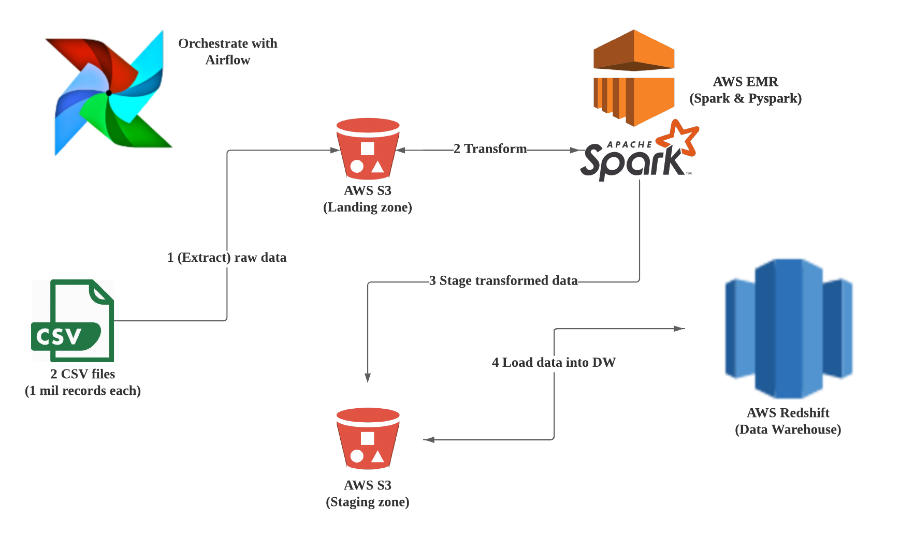
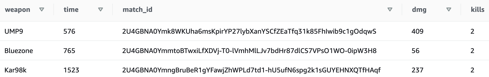

# Data Engineering with PUBG data
  This project is aimed to design a etl pipeline for a PUBG(online multi-player game) dataset. It takes in two datasets, join and transform them together to make them analysis-ready in a data warehouse. 

  The picture below gives a visualization of the overall data infrastructure. AWS is behind every stage except Airflow, which provides the orchestration and lineage of data.




# How to run
  Here are the pre-requisites in order to to run the project.
- Airflow : for overall data orchestration
- AWS Credentials : stored in Airflow Variable, for access to EMR and Reshift

  Spark processing is done with step execution of EMR using IaaC with boto3. Therefore, the script for the step execution must be stored in S3 to be called during cluster creation. The file which contains all the processing code is `etl_pubg.py`, so save the file in your own S3 arn and change the file location in `emr_helpers.py`.

  After these are ready, run the airflow dag(`capstone-pubg-etl`).

### Reminder
  During the execution of the DAG, it will take a while for the `check_emr_cluster` to run. That's because the specific task is waiting for the EMR step to be finished, which would take around 7~10 minutes.


# Description of Redshift modeling

  Before outlining the data warehouse structure, I would first like to give credit to the original creator of the dataset. I got the dataset from Kaggle, where KP uploaded about three years ago. Follow this url : https://www.kaggle.com/skihikingkevin/pubg-match-deaths

  The original dataset is divided into two csv files, each consists of different information. In a very general sense, the `aggregate.csv` contains aggregate data of a player in one of his/her games. On the other hand,`deaths.csv` data is about each kill-death event.


## The reason for each software used

  `Star schema` was chosen in order to provide denomralized table forms for easy table joins. I specifically had the data scientsts & analysts in mid when making modeling. Because all my data are related to the game itself and not to sales or other business metrics.
  Therefore, `Redshift` was selected because it provides fast reads and easy aggregation by columns. Location data became the fact table since lots of insights can be found by restricting an area of a map. A sample query to look for insights based on part of the map area can be like as follows,
```sql
SELECT de.weapon, de.time, m.match_id, p.dmg, p.kills
FROM locations l
JOIN dates da ON l.date_id = da.game_time
JOIN details de ON l.detail_id = de.detail_id
JOIN matches m ON l.match_id = m.match_id
JOIN performances p ON l.performance_id = p.performance_id
WHERE l.killer_position_x BETWEEN 2000.0 and 600000.0
	AND da.month = 10
LIMIT 3
```
  This query results this result for my dataset.

  (for a result of one complete row, check out the 'complete.csv' in the images folder)

  Lastly, `Spark` not only offers an amazing processing speed by using in-memory computation, but contains a machine learning library for data scientists. It can also access directly to S3 buckets for processing, and provides step execution meaning I don't have to keep my EMR cluster alive 24/7 but create them only when I have to use them which is extremely cost-efficient.
  
  For a complete __**data dictionary**__, click this [link](images/data_dictionary.md).

# Airflow task description


  Here are the details of each of the tasks.

- begin_execution : a dummy operator signaling the start
- emr_step_spark : runs the python callable `run_spark_step` in `plugins/emr_helpers.py`. This function uses boto3 in order to utilize IAAC to run a EMR cluster for a spark application and terminate after step completion.
- check_emr_cluster : runs the python callable `check_emr_cluster` which ensures the step completion of the created EMR cluster. Raises a ValueError when the step was incomplete.
- create_redshift_tables : creates the star and dimension tables in redshift
- load_dimension_ : load the redshift tables by copying from the processed csv file in S3
- check_tables : validates the data by checking unwanted null values
- end_execution : a dummy operator signaling th end

# Special Scenarios

  Q: When the data was increased by 100x, do you store the data in the same way? If your project is heavy on reading over writing, how do you store the data in a way to meet this requirement? What if the requirement is heavy on writing instead?
  - For a bigger size of data, it will still be stored in S3 because it is the most cost-efficient way to store large volumes of data in the cloud. A data catalogue would be helpful if more variations are introduced to the data. Storing in S3 also gives us the ability to process and analyze directly with EMR clusters(spark). More nodes can be added to the cluster for bigger and faster transforming or analyzing.
  Redshift is also a great choice with bigger data size, because it has its advantages in scaling and reading. Like EMR, nodes can be added to the Redshift cluster for further scaling, and it has offers an amazing speed in terms of query speed by using MPP. However, it is not optimized for heavy writing tasks, in which case a database like Cassandra would be a better fit.

  Q : How do you run this pipeline on a daily basis by 7 am every day. What if the dag fails, how do you update the dashboard? Will the dashboard still work? Or will you populate the dashboard by using last day?
  - The pipeline can be ran daily at 7am by using the `schedule_interval` argument for the airflow dag. In case of dag failure, it can also be configured to retry as well. The data is stored by date in the S3 bucket for ed users to be sure on the update status.

  Q : How do you make your database could be accessed by 100+ people? Can you come up with a more cost-effective approach? Does your project need to support 100+ connections at the same time?
 -  Redshift offers 'concurrency scaling' which provides a solution to 'burst read' situations. If configured, it automatically scales the redshift up to 10 clusters which can support more than 100 concurrent connetions. Since my project is mostl for data-scientists or data-analysts who's trying to gather in-game insight rather than BI personnels, there would not be a need for 100+ connections generally.
