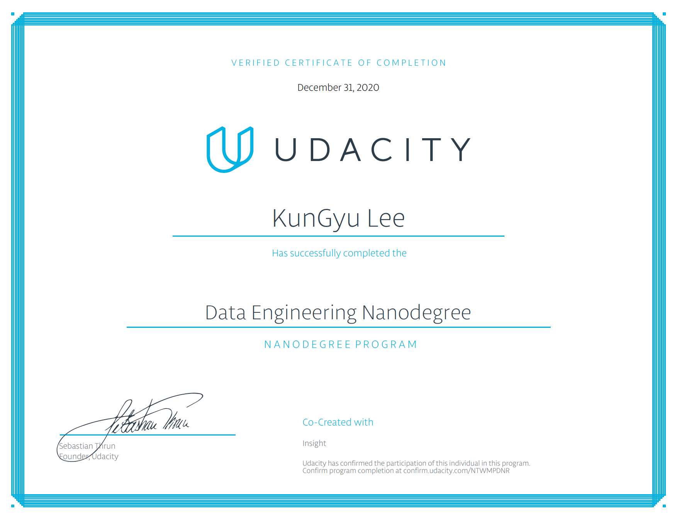

(For an english version README, check out the images folder)

# PUBG 데이터셋을 활용한 데이터 엔지니어링
  이 프로젝트는 캐글에 올라온 펍지 데이터를 가지고 ETL 파이프라인을 디자인하고 구현하는 프로젝트 입니다. 총 두개의 데이터셋을 가지고 서로 조인하고 가공을 해서 analysis-ready한 결과물로 만들어서 웨어하우스에 저장을 합니다. 이 프로젝트는 Udacity의 캡스톤 프로젝트이고, 처음 설계부터 모든 코드 구현을 혼자 했습니다.

  아래는 시각화를 이용해서 전체적인 데이터 플로우와 인프라를 보여줍니다. 모든 단계에는 AWS의 서비스를 사용했고, Airflow를 통해서 orchestration 및 lineage를 관리했습니다.


# 실행하는 방법
  프로젝트를 clone해서 실행하기 위해서 필요한 부분들은 다음과 같습니다.
- Airflow : 전체적인 실행을 주관
- AWS 접속키 : 아마존 웹서비스의 루트 혹은 IAM의 access_key_id 혹은 secret_acess_key가 필요

  에어플로우에서 AWS접근을 IaC인 boto3를 활용을 하는데, 랜딩된 데이터셋을 가공하기 위해서 EMR 클러스터를 만들고 Spark job을 실행합니다. 이 때 Spark job과 관련된 스크립트가 미리 S3버켓에 저장돼 있어서 IaC스크립트에서 지정해줘야 하기 때문에, Spark job인 `elt_pubg.py` 파일을 개인의 S3버킷에 저장하고, `airflow/plugins/emr_helpers.py`에 해당 파일의 ARN을 교체해주면 된다.

  위에 단계들이 충족됐을 때, 에어플로우 웹서버와 스케줄러를 실행하고, `capstone-pubg-elt` DAG를 런 시키면 됩니다.

### 주의할 점
  해당 DAG가 돌아갈 때, `check_emr_cluster` 단계에서 넘어가기까지 좀 오래 걸립니다. 그 이유는 EMR cluster를 만들어서 Spark job을 완성할 때까지 기다리는 task이기 때문인데, 대략 10분정도 소요됩니다.

# Redshift 모델링

  먼저 데이터를 어떻게 모델링 했는지 설명하기 전에, 이 데이터셋은 KP라는 유저가 캐글에 올라온걸 사용했습니다. 원래 파일은 훨씬 더 큰데, 프로젝트 요구조건이 최소 100만 레코드인 데이터에 대한 ETL이기 때문에 shell command 인`split -l 1000000 aggregate.csv`로 파일을 나누었습니다.

  총 두가지 CSV파일이 있는데, `aggregate.csv`와 `deaths.csv`가 있습니다. Aggregate 파일은 한 게임에서 한 유저의 게임스탯이 포함돼 있고, Deaths 파일은 각 이벤트(killer-victim) 와 관련된 정보가 담겨져 있습니다


## 모델링과 관련된 스택을 선택한 이유

  모델링 사진을 보시면 최종적으로 **__Star Schema__** 를 적용했는데, 원래 두개의 데이터셋에서 여러개의 비정규화된 형태로 바꿈으로서 조인이 쉬워지고, 최종 사용자(데이터 사이언티스트나 분석가)가 더 직관적으로 & 쉽게 분석을 할 수 있도록 모델링을 했습니다.
  웨어하우스로는 **__AWS Redshift__**를 선택했는데, 그 이유는 빠른 read와칼럼별  aggregate에 장점이 있어서 입니다. **__Fact__**에 killer-victim과 관련된 장소 데이터가 들어가 있는 이유는, 특정 location에서 발생하는 이벤트로 여러가지 인사이트를 얻고 테스트를 할 수 있기 때문입니다.

  아래와 같은 sql로 특정 장소에서 발생한 이벤트들에 대한 게임 정보및 이벤트 정보를 확인할 수 있습니다.
```sql
SELECT de.weapon, de.time, m.match_id, p.dmg, p.kills
FROM locations l
JOIN dates da ON l.date_id = da.game_time
JOIN details de ON l.detail_id = de.detail_id
JOIN matches m ON l.match_id = m.match_id
JOIN performances p ON l.performance_id = p.performance_id
WHERE l.killer_position_x BETWEEN 2000.0 and 600000.0
	AND da.month = 10
LIMIT 3
```
  이 쿼리의 결과는 다음과 같습니다. 모든 테이블을 조인한 결과는 이 [csv](images/complete.csv)를 확인하시면 됩니다.


  마지막으로 **__Spark__** 를 사용한 이유는 in-memory을 사용하는 강력한 컴퓨팅이 첫번째 이유이고, EMR를 사용한다면 클러스터를 계속 살려둘 필요없이 필요할 때만 만들어서 S3에 저장된 파일을 접근해서 step execution을 통해 작업을 가능케 해주는 가성비와 편의함 때문 입니다.

  제가 만든 웨어하우스 데이터와 관련된 __**data dictionary**__는 이 [link](images/data_dictionary.md)를 확인하실 수 있습니다.

# Airflow 작업 설명


  각 작업에 대한 디테일들 입니다.

- begin_execution : DummyOperator로, DAG을 시작을 알림
- emr_step_spark : `plugins/emr_helpers.py`에 있는 `run_spark_step`이라는 python_callable을 실행, AWS EMR 클러스터를 만들고 지정된 step을 실행시키고 결과물을 S3에 스테이징한 후 클러스터 자동종료
- check_emr_cluster : 같은 파일의 `check_emr_cluster`을 실행, 생성된 클러스터의 상태를 3분마다 체크하면서 step이 성공했을 경우 다음 단계로, 실패했을 경우 에러를 띄워서 DAG를 멈춤
- create_redshift_tables : 웨어하우스에 테이블이 없을 경우 생성, 나중에 분석을 할 경우를 미리 생각해서 DISTKEY와 SORTKEY를 지정
- load : 스테이징 존에 있는 paquet파일을 로드해서 해당 테이블에 저장
- check_tables : 각 테이블마다 검증을 진행, NULL이 없어야 하는 칼럼에 NULL이 없는지 확인 - 자동으로 칼럼에 값이 들어갔는지 확인
- end_execution : DAG를 마무리하는 DummyOperator


