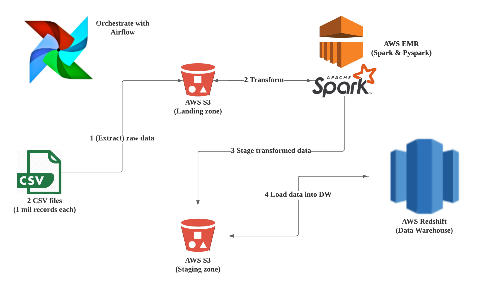

# Data Engineering with PUBG data
  This project is aimed to design a etl pipeline for a PUBG(online multi-player game) dataset. Two csv files, a million records each, that contain raw data is extracted to a S3 bucket. Then, AWS EMR is utilized to process the data using Spark application. The transfromed data is also stored in a separate S3 bucket, before finally loaded into AWS Redshift, which is our Data Warehouse for further analysis.

  The picture below gives a visualization of the different stages of the process, that is all orchestrated with Airflow for ensuring data validation and lineage.

