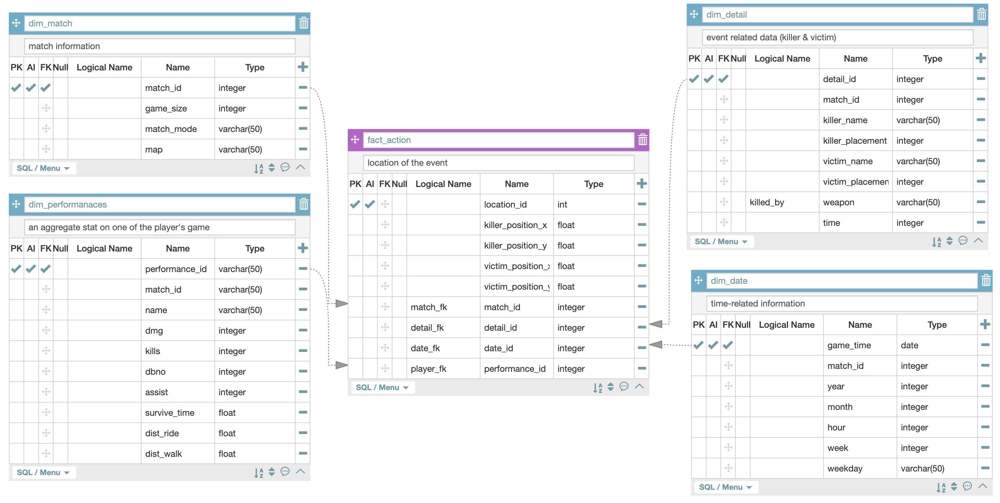
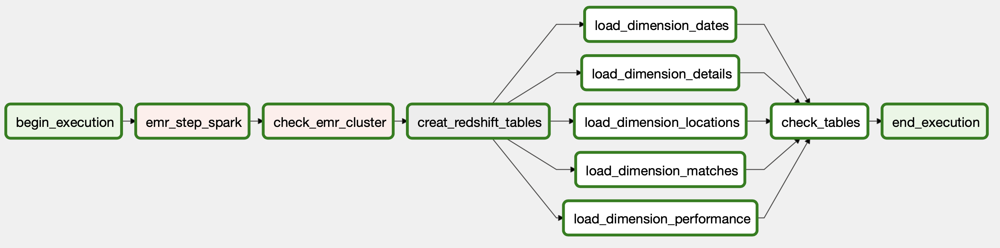

# Data Engineering with PUBG data
  This project is aimed to design a etl pipeline for a PUBG(online multi-player game) dataset. It takes in two datasets, join and transform them together to make them analysis-ready in a data warehouse. 

  The picture below gives a visualization of the overall data infrastructure. AWS is behind every stage except Airflow, which provides the orchestration and lineage of data.

# How to run
  Here are the pre-requisites in order to to run the project.
- Airflow : for overall data orchestration
- AWS Credentials : stored in Airflow Variable, for access to EMR and Reshift

  Spark processing is done with step execution of EMR using IaaC with boto3. Therefore, the script for the step execution must be stored in S3 to be called during cluster creation. The file which contains all the processing code is `etl_pubg.py`, so save the file in your own S3 arn and change the file location in `emr_helpers.py`.

  After these are ready, run the airflow dag(`capstone-pubg-etl`).

### Reminder
  During the execution of the DAG, it will take a while for the `check_emr_cluster` to run. That's because the specific task is waiting for the EMR step to be finished, which would take around 7~10 minutes.

# Description of Redshift modeling

  Before outlining the data warehouse structure, I would first like to give credit to the original creator of the dataset. I got the dataset from Kaggle, where KP uploaded about three years ago. Follow this url : https://www.kaggle.com/skihikingkevin/pubg-match-deaths

  The original dataset is divided into two csv files, each consists of different information. In a very general sense, the `aggregate.csv` contains aggregate data of a player in one of his/her games. On the other hand,`deaths.csv` data is about each kill-death event.

  In my modeling process, I've decided to location data of each action(kill-death) would be my fact table data. By making them the focal point, different analysis on different interest can be done by looking at what kind of event happened in what areas of the map.  

# Airflow task description

  Here are the details of each of the tasks.

- begin_execution : a dummy operator signaling the start
- emr_step_spark : runs the python callable `run_spark_step` in `plugins/emr_helpers.py`. This function uses boto3 in order to utilize IAAC to run a EMR cluster for a spark application and terminate after step completion.
- check_emr_cluster : runs the python callable `check_emr_cluster` which ensures the step completion of the created EMR cluster. Raises a ValueError when the step was incomplete.
- create_redshift_tables : creates the star and dimension tables in redshift
- load_dimension_ : load the redshift tables by copying from the processed csv file in S3
- check_tables : validates the data by checking unwanted null values
- end_execution : a dummy operator signaling th end
